**简介**

现代组织需要智能系统，能够快速分析运营
data，提供有意义的洞察，而无需复杂的data流动。在此使用场景中，Microsoft
Fabric 用于将 Azure SQL Database中的数据镜像到 Fabric 环境，并创建一个
Fabric Data Agent，用于查询和分析镜像 data。

流程始于创建一个包含示例业务 data的 Azure SQL
Database。該database隨後通過Azure SQL鏡像技術鏡像到Microsoft
Fabric中，實現對Fabric工作區內運營數據的近實時訪問。一旦鏡像
database可用，Fabric Data Agent會被配置用於連接
data源並回答自然語言查詢。

這種方法使用戶能夠通過智能代理與企業數據互動，從而在無需編寫複雜SQL查詢的情況下，更快地洞察產品性能、客戶分佈和銷售趨勢。

**目标**

本实验室的目标是演示如何构建和配置一个能够分析来自Azure SQL
Database的镜像运营 data的Fabric Data Agent。

完成本实验后，您将学会如何：

- 创建一个 带有示例数据的 **Azure SQL Database**。

- 创建一个 **Microsoft Fabric workspace**来托管数据和分析资源。

- 利用Azure SQL镜像**将Azure SQL Database镜像到Microsoft Fabric**中。

- 配置一个 **Fabric Data Agent**并将其连接到镜像数据库。

- 通过**自然语言prompts**查询 data以生成洞察。

- 通過分析問題樣本驗證代理的反應。

## **任務0：同步主機環境時間**

1.  在你的 VM 里，点击 **Search bar**，输入 **Settings**，然后点击
    **Best match** 中的 **Settings**。

> 

2.  在 Settings 窗口中，点击 **Time & language**。

3.  在 **“Time & language** ”页面，点击**“Date & time**”。

4.  向下滚动，进入 **“Additional settings** ”部分，然后点击 **“Syn now**
    ”按钮。同步需要3-5分钟。

5.  关闭 **Settings** 窗口。

## 任务1：创建一个单一database - Azure SQL Database

在这个任务中，你将创建一个包含示例 data的完整配置的Azure SQL
Database。你将部署 AdventureWorksLT
示例模式，验证表，并准备服务器连接细节以备后续在 Fabric 中镜像。

1.  打開瀏覽器，進入+++https://portal.azure.com+++，並用下面的Cloud
    Slice賬號登錄。

2.  在 Azure 門戶主頁，點擊 Microsoft Azure 命令欄左側的三個水平條表示的
    **Azure 門戶菜單**。选择SQL database

3.  点击 **+ Create**

> 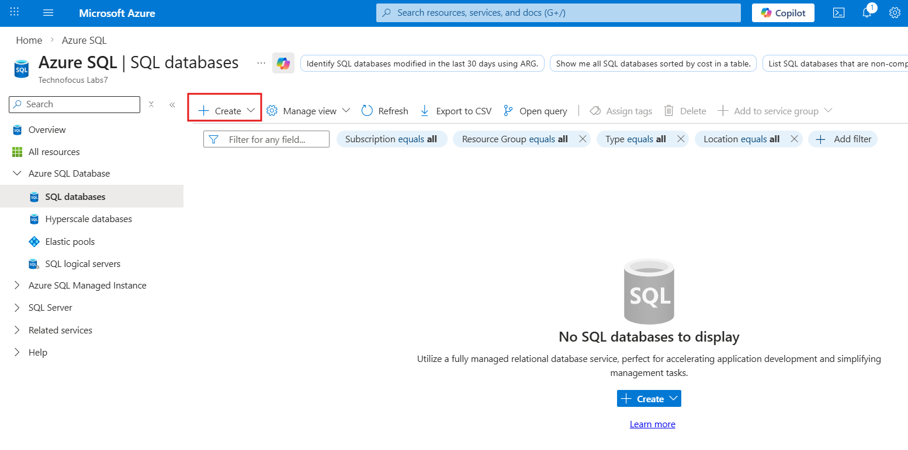

4.  在**“Create a storage account**”窗口，**Basics**标签下
    输入以下信息创建存储账户，然后点击 **“Next:Networking**

[TABLE]

5.  在计算 + Storage部分，点击**Configure database**。

6.  服务层级在下拉菜单中选择 **Standard(Budget Friendly) and for DTU
    enter 100 **并点击**Apply**

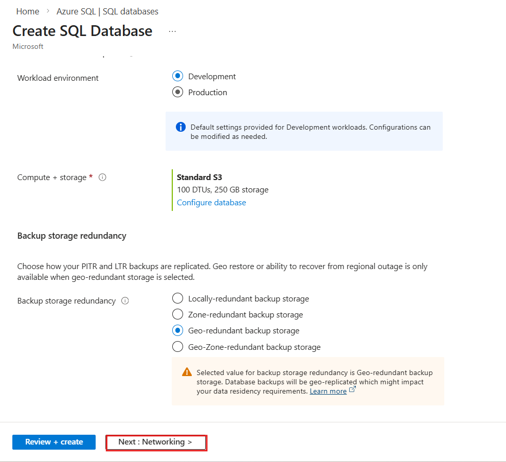

7.  在**Networking**标签页中，选择**Public endpoint**，将 **Allow Azure
    services and resources**设置为**“Yes**”，启用 **Add current client
    IP address**，然后点击 **Next: Security\>**

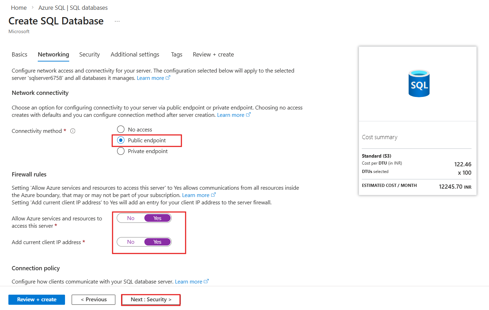

8.  在**Security** 页面，审核后选择**“Next : Additional settings”**

> 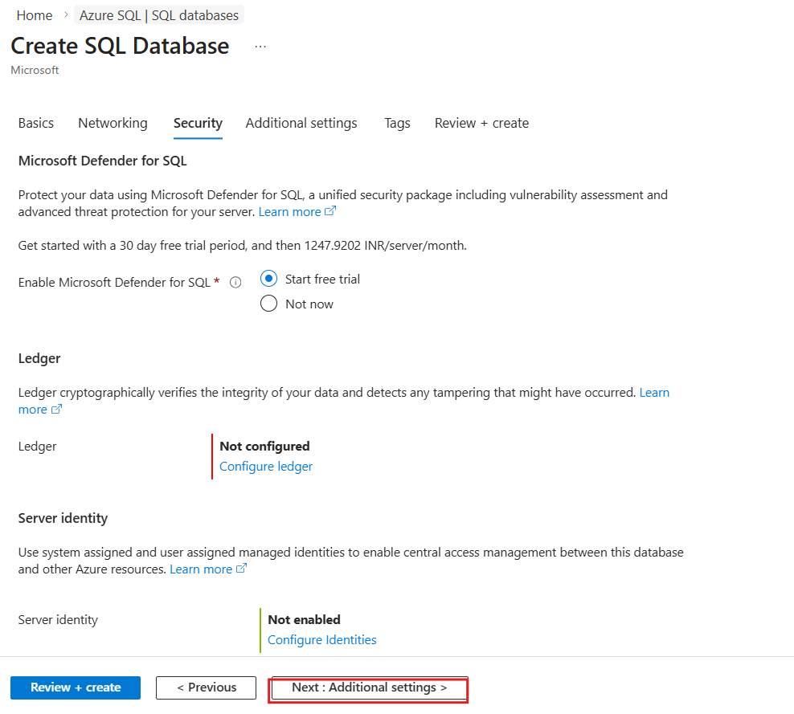

9.  在*“Additional settings*”标签中，选择**“**使*existing
    data”中的***Sample***，提示时*选择**“AdventureWorksLT**”，点击**OK**，然后选择**“Review +
    create**”继续。

> 

10. 在**“Review + create**”页面，审核后选择**Create**

> 
>
> 

11. 在 **Microsoft.SQLDatabase** 窗口中，部署完成后，点击**“Go to
    resource**”按钮。

> 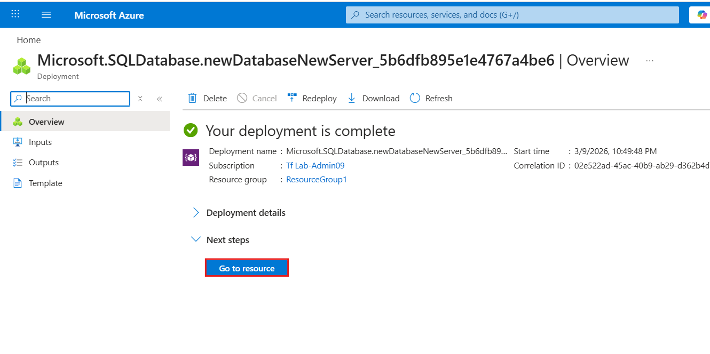

12. 在SQL database页面选择 **Query editor**。

> 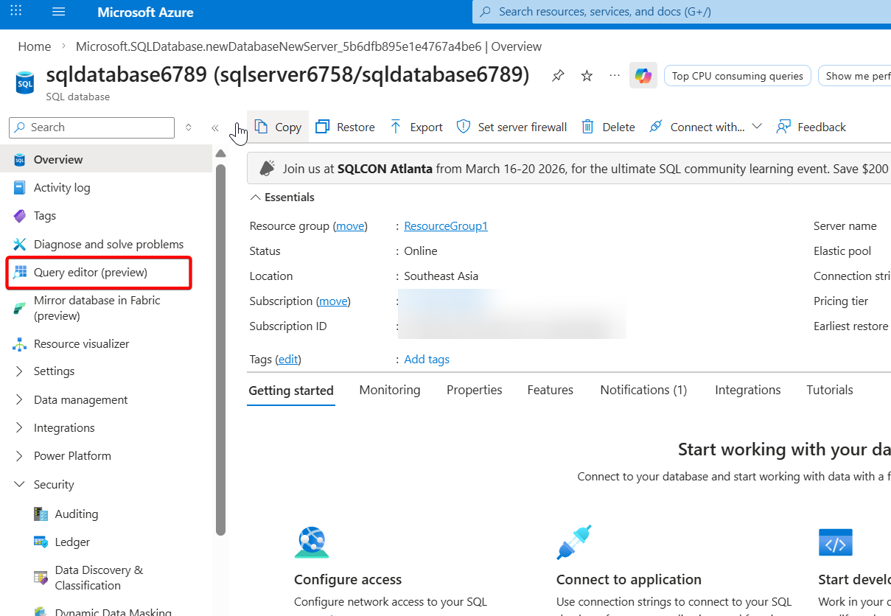

13. 在 **Query editor (preview)**
    中，输入SQL服务器**login**为**sqladmin**，**密码**为+++**password321!+++**，然后点击**OK** 连接
    database。

> 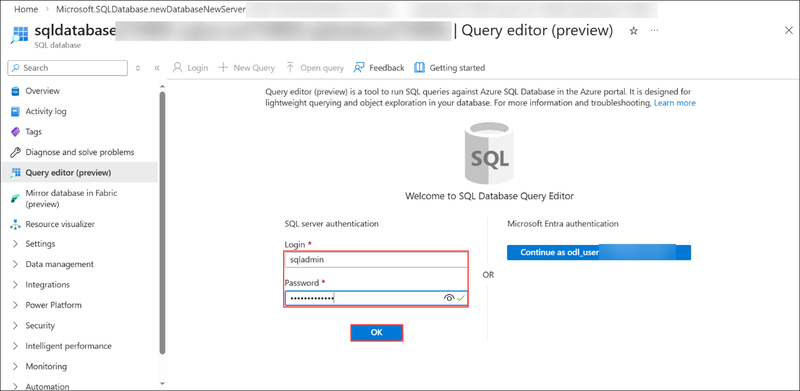

14. 確保所有採樣表都已成功部署。

15. 回到你的SQL Database。复制 **Server name** (1) 和**SQL Database
    name** (2)，粘贴到记事本，然后**Save**记事本以便在即将完成的任务中使用这些信息。

> 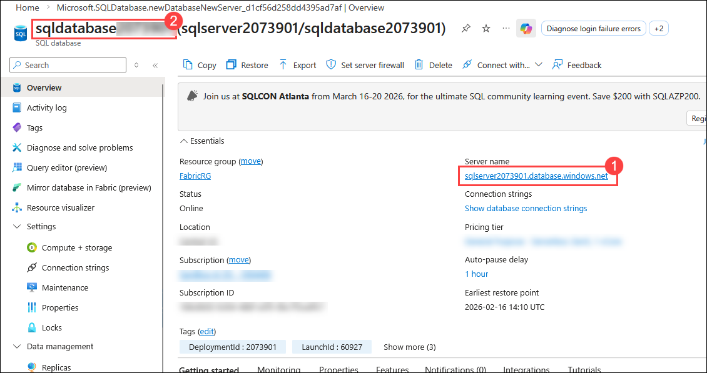

1.  点击 **Home** 返回主页

> 

2.  点击 **Resource groups。**

> 

3.  点击 **ResourceGroup1** 资源组。

> 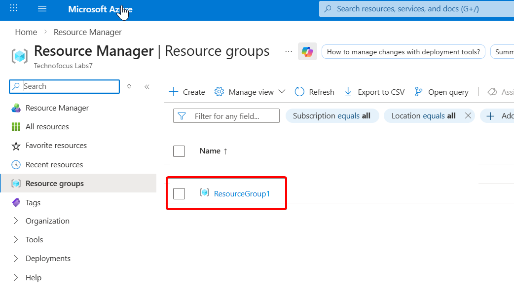

4.  选择 **SQL server**

> 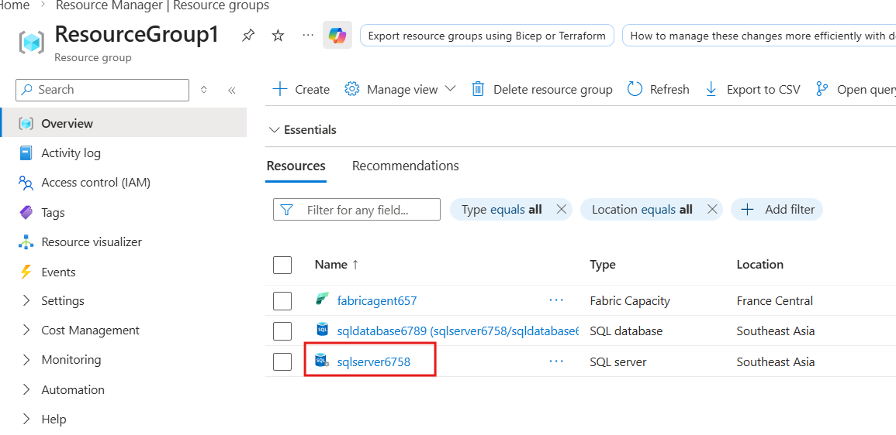

5.  進入身份，將系統分配的託管身份狀態切換為 **On**，然後點擊 **Save**
    應用更改。

> 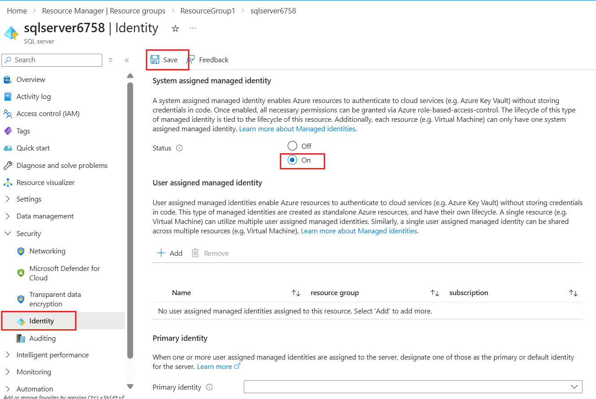
>
> 

## 任务2：创建Fabric workspace

在这个任务中，你需要创建一个Fabric workspace。工作区包含了本 lakehouse
教程所需的所有内容，包括 lakehouse、dataflows、Data Factory
管道、notebooks、Power BI datasets和报表。

1.  打开浏览器，进入地址栏，输入或粘贴以下URL:+++https://app.fabric.microsoft.com/+++ 按下**Enter**键，并用你的凭证登录

[TABLE]

2.  Fabric主页，选择 **+New workspace**瓷砖。

> 

3.  在**Create a
    workspace** 面板中，输入以下细节，然后点击**“Apply**”按钮。

[TABLE]

> 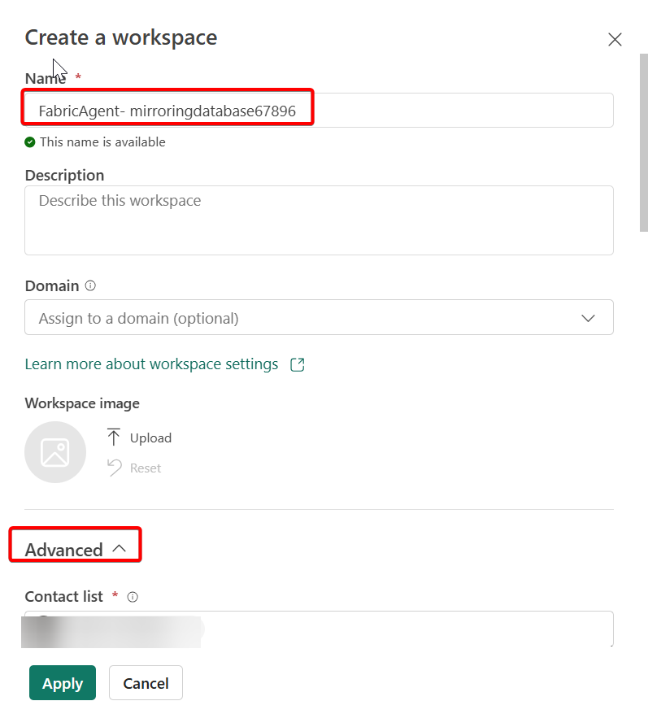

注意：要查找您的实验室instant ID，请选择“Help”并复制instant ID。

> 
>
> 

4.  等待部署完成。完成大約需要2-3分鐘。

> 

## 任务3：创建利用Azure SQL Mirroring技术Mirror Data的解决方案

在这个任务中，你将使用 Azure SQL Mirroring将 Azure SQL Database连接到
Microsoft Fabric。你將選擇表，創建鏡像database，並驗證
data是否成功同步。

1.  点击导航栏中的 **+New item** 按钮创建新lakehouse

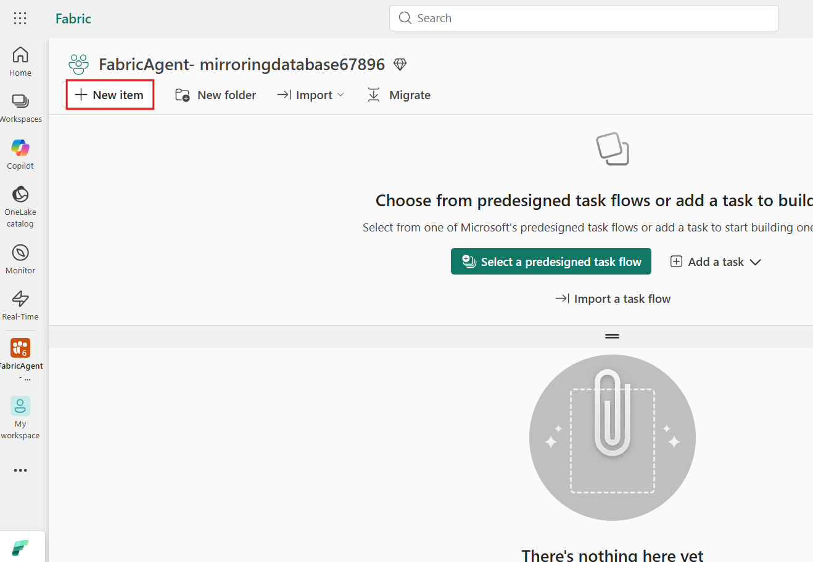

1.  在**Filter by keyword** 框中，输入**+++Mirrored Azure SQL
    Database+++**，然后选择 **Mirroed Azure SQL Database** 项。

2.  在“ **Choose a database connection to get started** ”窗口中，选择
    **Azure SQL database**

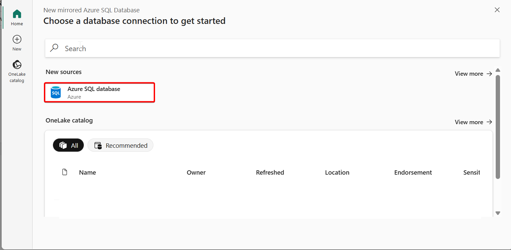

3.  在Connection设置标签中输入以下详细信息，点击Connect按钮

[TABLE]

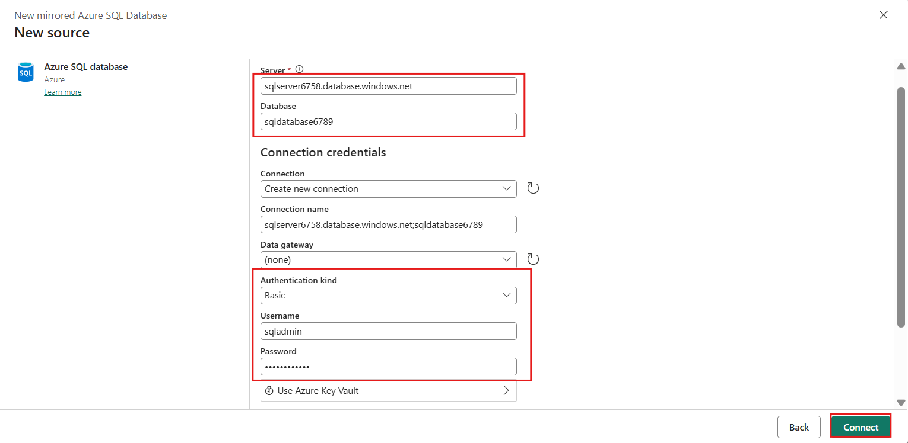

7.  在“ **Choose data** ”窗口，选择 **Select all** ，然后点击
    **Connect** 按钮

> 

8.  在“Destination”标签中，点击**“Create mirrored database”**

> 

9.  点击 **Refresh** 以更新并查看最新变更。

> 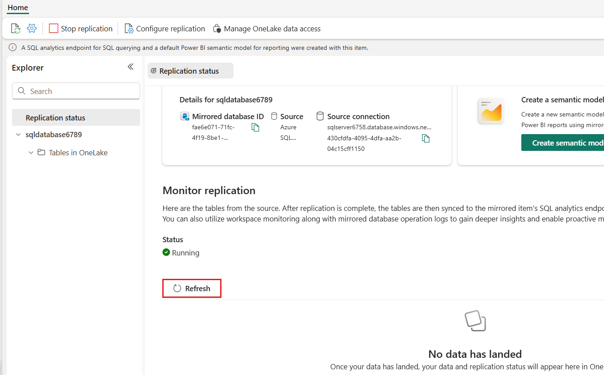
>
> 

1.  在左侧导航菜单中，点击并点击
    ***FabricAgent-mirroringdatabaseXXXX***，如下图所示。

> 

## 任务4：创建Data Agent并连接Mirrored Database

在这里，你将创建一个新的 Fabric Data Agent，并配置它使用镜像的 Azure SQL
Database作为其数据源。該智能體會利用鏡像data響應自然語言prompts。

1.  在**Fabric**主页，选择 **+New item。**

3.  在**“Filter by item type”**搜索框中，输入 **+++data agent+++**
    并选择 **Data agent。**

> 

4.  输入 **+++FabricDataAgent @lab.LabInstance.Id+++** Data
    agent名称，然后选择**Create**。

> 

5.  选择 **Add data source** 以配置新的data source。

> 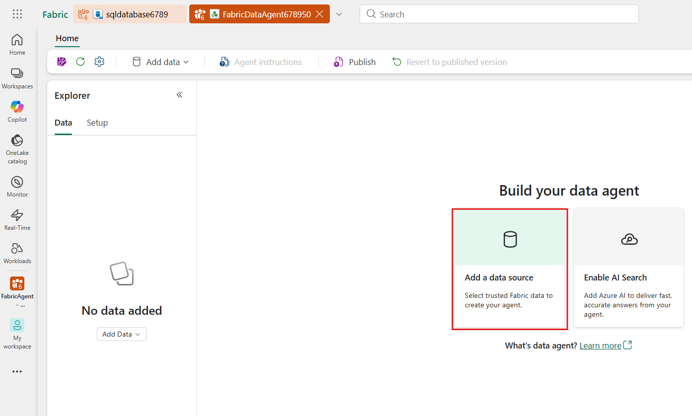

6.  請選擇您用於本次研討會的鏡像 database資源

> 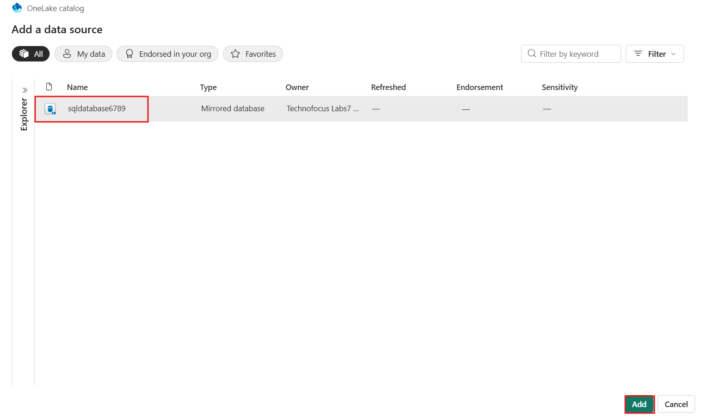
>
> 

## 任務5：測試代理

你將通過提出以下分析性問題來測試Data Agent：

- *哪些產品類別的銷售額最高？*

- *掛牌產品標價高但銷量低。*

- *哪些城市擁有最多的客戶？*

這驗證了客服理解和響應業務查詢的能力。

1.  为所有表选择 **SalesLT** 模式。

2.  在你的 Fabric data agent 查询面板中，输入问题 *+++***Which product
    categories generate the highest
    sales?+++**并点击发送图标查看代理的回复

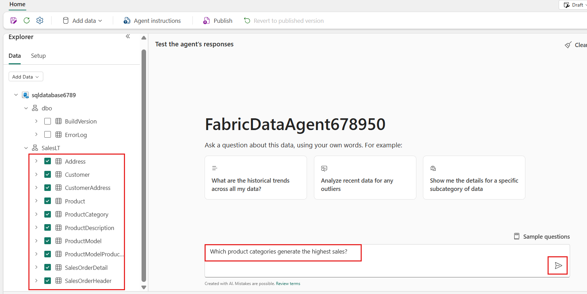

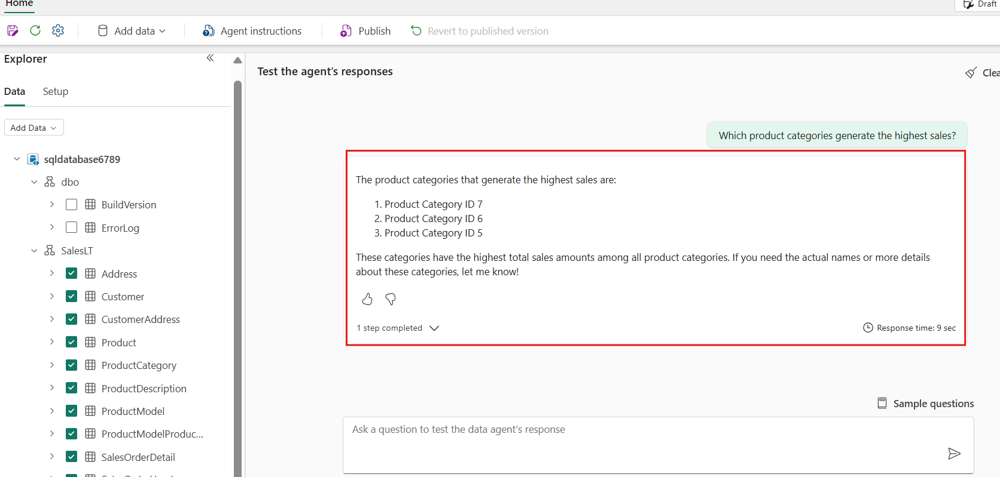

3.  要測試代理，運行應用程序並輸入樣本問題以驗證回答。

++++List products with high list price but low sales volume.+++

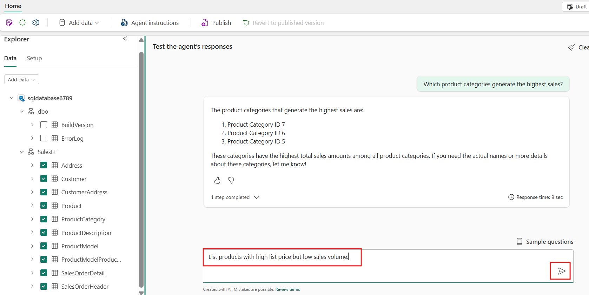

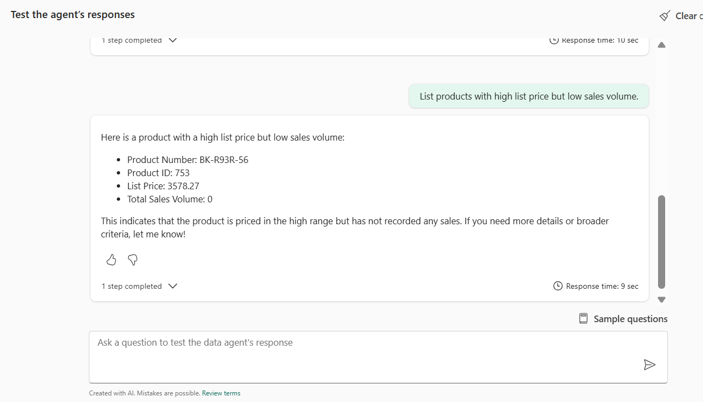

+++**List the cities with the highest number of customers**+++

> 

4.  点击顶部菜单中的“**Fabric data agent**”。

5.  从顶部菜单点击“Publish”，然后选择 **“Publish**”。

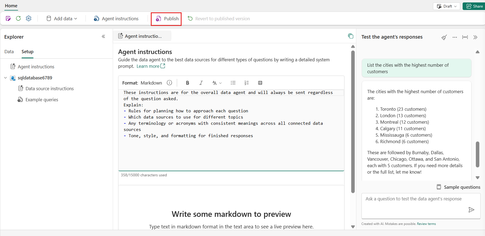

6.  现在，点击左侧导航面板上的 **FabricAgent-mirroringdatabaseXXXXXX**。

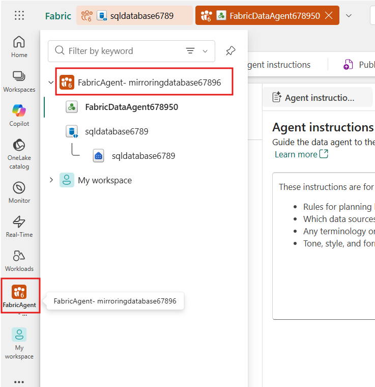

## 任务6：删除资源

1.  选择...... 在工作区名称下选择选项，选择 **Workspace settings**。

> 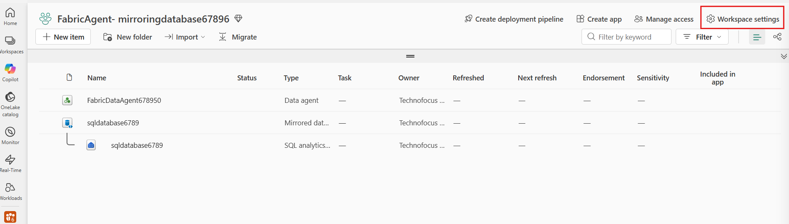

2.  选择**“General**”并**Remove this workspace。**

> 

3.  点击弹出的警告中“**Delete**”。

> 

4.  等待工作區被刪除的通知後，再進入下一個實驗室。

> 

7.  打開瀏覽器，進入+++https://portal.azure.com+++，並用下面的Cloud
    Slice賬號登錄。

8.  要删除资源，请在 Azure 门户搜索栏输入 **Resource
    groups**，然后在**Services**中导航并点击**Resource groups** 。

9.  在Resource groups页面，选择你的Resource groups。

10. 在**Resource Group**主页，选择除 **Fabric
    Capacity**外的所有资源，然后点击**Delete**。

11. 在右侧出现的**“Delete
    Resources**”面板中，点击输入**“delete”确认删除**字段，然后点击**Delete**按钮

**摘要**

在本实验中，你成功创建了一个Azure SQL Database，并通过Azure SQL镜像将其
data镜像到Microsoft Fabric中。然后你配置了一个Fabric Data
Agent，连接镜像database，并通过自然语言查询分析data。

該代理能夠回答分析性問題，如識別暢銷產品類別、價格高但銷量低的產品，以及客戶數量最多的城市。這展示了
Microsoft Fabric 如何將運營data
sources與智能代理集成，簡化數據探索並實現更快的業務洞察。

這一用例凸顯了將 **data鏡像與 AI驅動的數據代理**結合起來，在Microsoft
Fabric生態系統中創造互動且智能的 data體驗的力量。
