## ユースケース03 - Microsoft Fabricでミラーリングされた Azure SQL Databaseを使用してFabric Data Agentを構築

**紹介**

現代の組織では、複雑なデータ移動を必要とせずに、オペレーショナルデータを迅速に分析し、有益な洞察を提供できるインテリジェントなシステムが求められています。このユースケースでは、Microsoft
Fabricを使用してAzure SQL
DatabaseからFabric環境にデータをミラーリングし、ミラーリングされたデータをクエリおよび分析できるFabric
Data Agentを作成します。

このプロセスは、サンプルビジネスデータを含む Azure SQL
Databaseを作成することから始まります。次に、このデータベースはAzure SQL
Mirroringを使用してMicrosoft
Fabricにミラーリングされ、Fabricワークスペース内のオペレーショナルデータに凖リアルタイムでアクセスできるようになります。ミラーリングされたデータベースが利用可能になったら、Fabric
Data Agentが構成され、データソースに接続して自然言語クエリに応答します。

このアプローチにより、ユーザーはインテリジェントエージェントを介して企業データとやり取りできるようになり、複雑なSQLクエリを作成することなく、製品のパフォーマンス、顧客分布、販売動向に関するより迅速な洞察を得ることができます。

**目的**

このラボの目的は、 Azure SQL Database
からミラーリングされたオペレーショナルデータを分析できる Fabric Data
Agent を構築および構成する方法を示すことです。

この実習を完了することで、以下のことを学ぶことができます。

- **Azure SQL Database**を作成します。

- データおよび分析リソースをホストするための**Microsoft
  Fabricワークスペース**を作成します。

- **Azure SQL Mirroringを使用して、 Azure SQL Databaseを Microsoft
  Fabric に**ミラーリングします。

- **Fabric Data
  Agent**を設定し、ミラーリングされたデータベースに接続します。

- **自然言語のプロンプト**を使用してデータをクエリし、洞察を生成します。

- サンプル分析質問を用いて、エージェントの回答を検証します。

## **タスク0：ホスト環境の時刻を同期**

1.  VM内で、**検索バーに移動してクリックし**、
    **「Settings」と入力して、 「Best
    match」**の下にある**「Settings」**をクリックします。

> 

2.  **Settingsウィンドウで「Time & language」**をクリックします。

3.  **「Time & language」ページ**で、**「Date &
    time」**に移動してクリックします。

4.  **「Additional settings」**セクションに移動し、 **「Syn
    now」**ボタンをクリックします。同期には3～5分かかります。

5.  **Settingsウィンドウ**を閉じます。

## タスク 1: 単一データベースの作成 - Azure SQL Database

を含む完全に構成済みの Azure SQL
Databaseを作成します。AdventureWorksLTサンプルスキーマをデプロイし、テーブルを確認し、後でFabricでミラーリングするためにサーバー接続の詳細を準備します。

1.  ブラウザを開き、+++https://portal.azure.com+++
    にアクセスして、以下のクラウドスライスアカウントでサインインします。
    |   |   |
    |---|---|
    | Username | +++@lab.CloudPortalCredential(User1).Username+++ |
    | TAP | +++@lab.CloudPortalCredential(User1).AccessToken+++ |

3.  Azure ポータルのホーム ページから、 Microsoft Azure コマンド
    バーの左側にある3本の横線で表される**Azure
    ポータルメニュー**をクリックします。SQL データベースを選択します。

3.  **「+Create」**をクリックします。

> 

4.  **「Create a storage account** **」**ウィンドウで、
    **「Basics** **」**タブの下に以下の詳細を入力してストレージアカウントを作成し、
    **「Next:Networking」**をクリックします。　

    | Setting | Value  |
    |--------|----------------|
    | Subscription | @lab.CloudSubscription.Name |
    | Resource group | @lab.CloudResourceGroup(ResourceGroup1).Name |
    | Database name | +++sqldatabase@lab.LabInstance.Id+++ |
    | Server | Select **Create new** |
    | Server name | +++sqlserver@lab.LabInstance.Id+++ |
    | Location | @lab.CloudResourceGroup(ResourceGroup1).Location |
    | Authentication Method | **Use SQL Authentication** |
    | Server admin login | +++sqladmin+++ |
    | Password | +++password321!+++ |
    | Confirm password | +++password321!+++ |
    | Action | Click **OK** |

5.  「Compute + Storage」セクションで、 **「Configure
    database」**をクリックします。

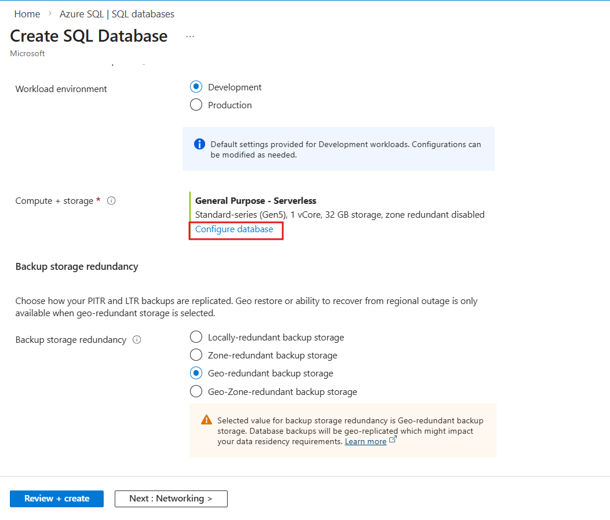

6.  Service tier のドロップダウンメニューから**「Standard(Budget
    Friendly)」を選択し、DTU**に100を入力して**「Apply」**をクリックします。

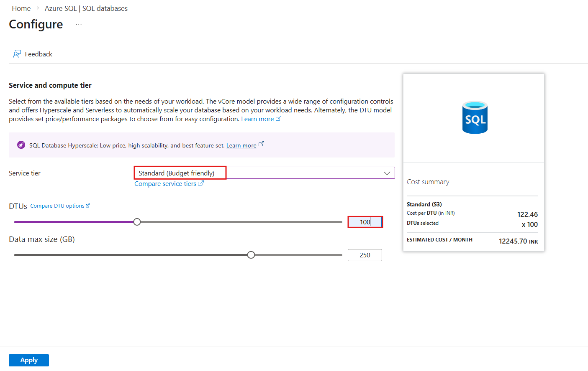

7.  **「Networking」タブ**で**「Public endpoint」**を選択し、 **「Allow
    Azure services and resources」を「Yes」**に設定し、 **「Add current
    client IP address」**を有効にして、 **「Next:
    Security\>」**をクリックします。

8.  **Security**ページで、内容を確認後、 **「Next : Additional
    settings」を選択します。**

> 

9.  **「Additional settings」**タブで  「Use existing
    data」*の下にある**「Sample」を選択し**、プロンプトが表示されたら**「AdventureWorksLT」**を選択して**「OK」**をクリックし、次に**「Review +
    create」を選択して**続行します。

> 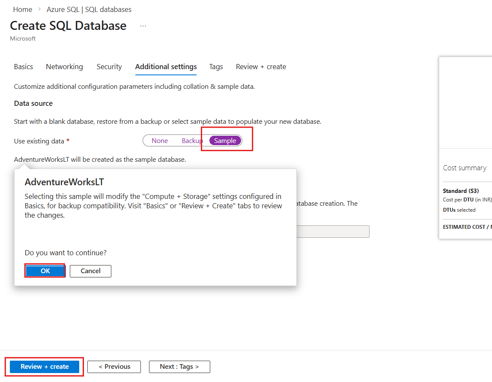

10. **「Review + create」ページ**で、レビュー後、
    **「Create」を選択します。**

> 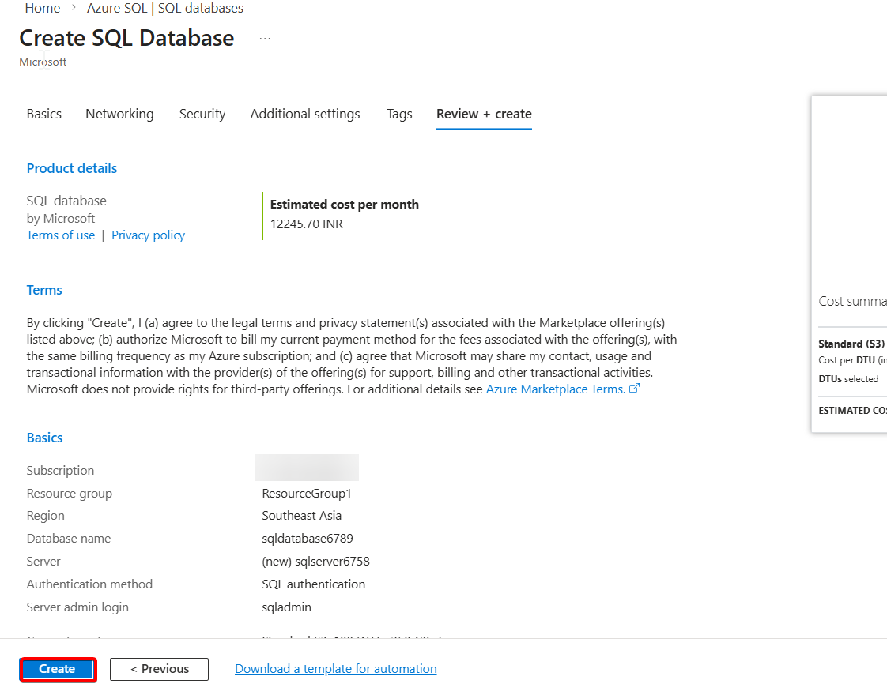
>
> 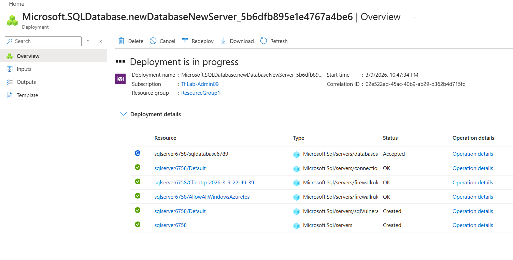

11. **Microsoft.SQLDatabase**ウィンドウで、デプロイが完了したら、 **\[Go
    to resource\]**ボタンをクリックします。

> 

12. SQLデータベースページで**Query editorを選択します**。

> 

13. **Query editor (preview)**で、SQL Server
    の**ログイン名**として**sqladmin** 、**パスワード**として +++
    **password 321! ++**を入力し、
    **\[OK\]**をクリックしてデータベースに接続します。

> 

14. すべてのサンプルテーブルが正常にデプロイされていることを確認します。

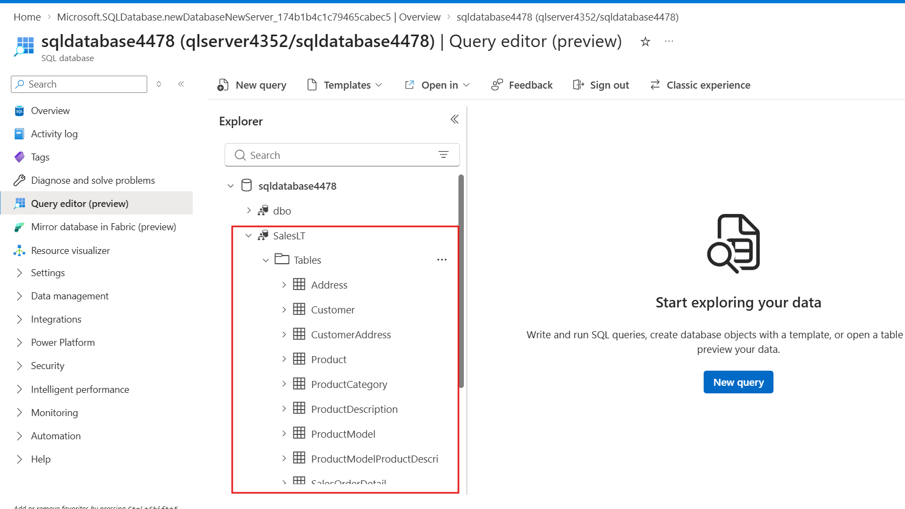

15. SQLデータベースに戻ります。**Server name** （1）と**SQL Database
    name**（2）をコピーし、メモ帳に貼り付けてから、メモ帳を**保存して、**次のタスクでその情報を使用します。

> 

1.  **Home**をクリックしてメインページに戻ります。

> 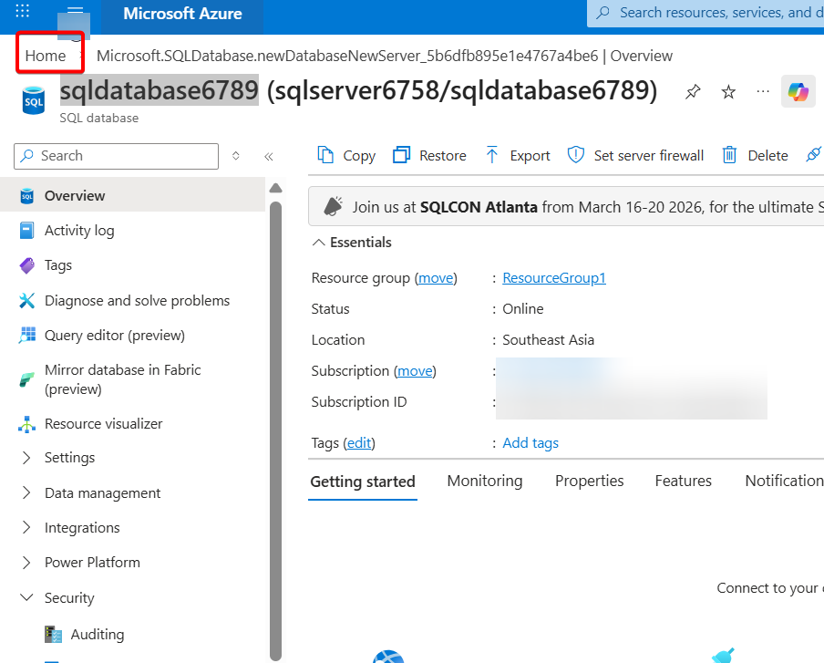

2.  **Resource groups**をクリックします。

> 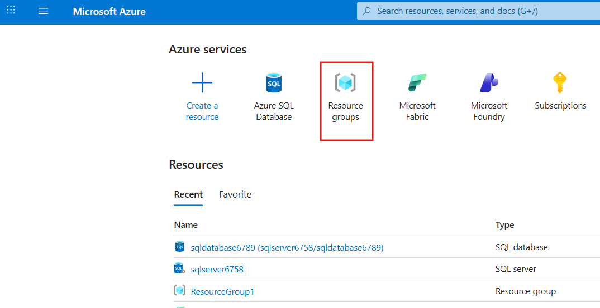

3.  **ResourceGroup1リソースグループ**をクリックします。

> 

4.  **SQLサーバー**を選択します

> 

5.  「Identity」に移動し、「System assigned managed
    identity」の状態を**「On」**に切り替えてから、
    **「Save」**をクリックして変更を適用します。

> 
>
> 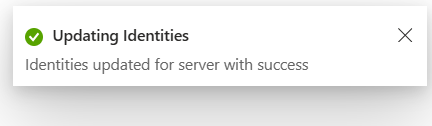

## タスク2：Fabricワークスペースを作成

このタスクでは、Fabricワークスペースを作成します。このワークスペースには、
レイクハウス、データフロー、Data
Factoryパイプライン、ノートブック、Power
BIデータセット、レポートなど、このレイクハウスチュートリアルに必要なすべてのアイテムが含まれています。

1.  ブラウザを開き、アドレスバーに移動して、次のURLを入力または貼り付けます。
    ++https://app.fabric.microsoft.com/+++。
    **Enter**キーを押して、資格情報でサインインします。

    |  |   |
    |---|----|
    |Username	|+++@lab.CloudPortalCredential(User1).Username+++|
    |TAP	|+++@lab.CloudPortalCredential(User1).AccessToken+++|

2.  Fabricのホームページで、 **「+** **New
    workspace**」タイルを選択します。

> 

3.  右側に表示される**「Create a
    workspace」**ペインに、以下の詳細を入力し、
    **「Apply」**ボタンをクリックします。

    | Property | Value |
    |---------|-------|
    | Name | +++FabricAgent-mirroringdatabase@lab.LabInstance.Id+++ |
    | Advanced | Under **License mode**, select **Fabric** |
    | Default storage format | Small dataset storage format |
    | Template apps | Check **Develop template apps** |

> 

注：ラボのインスタントIDを確認するには、「Help」を選択してインスタントIDをコピーします。

> 
>
> 

4.  デプロイが完了するまでお待ちください。完了まで2～3分かかります。

> 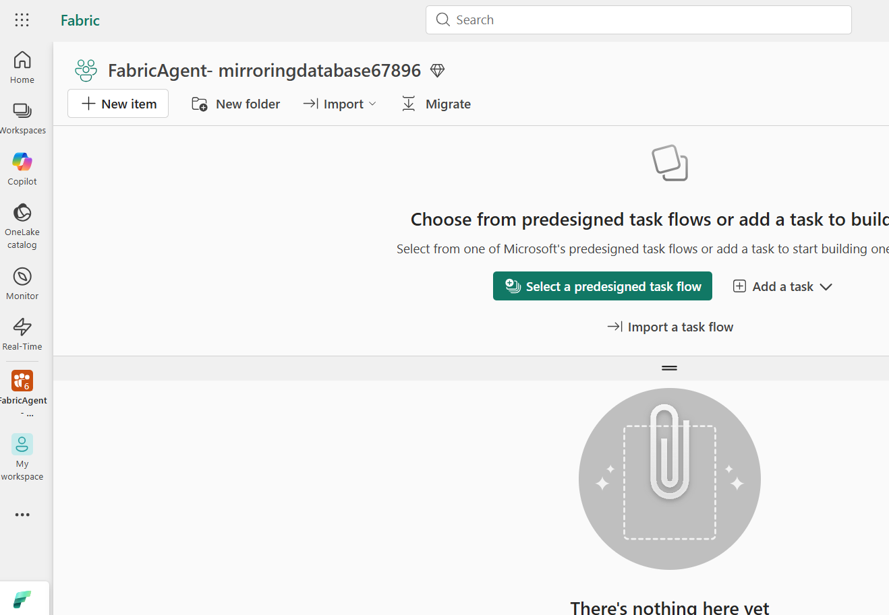

## タスク 3: Azure SQL Mirroringを使用してデータをミラーリングするソリューションを構築構築

このタスクでは、Azure SQL Mirroringを使用して Azure SQL Databaseを
Microsoft Fabric
に接続します。テーブルを選択し、ミラーリングされたデータベースを作成し、データが正常に同期されたことを確認します。

1.  ナビゲーションバーの**「+** **New
    item」**ボタンをクリックして、新しいレイクハウスを作成します。

1.  **Filter by keyword**検索ボックスに**「+++Mirrored Azure SQL
    Database+++」**と入力し、「 **Mirrored Azure SQL
    Database」**を選択します。

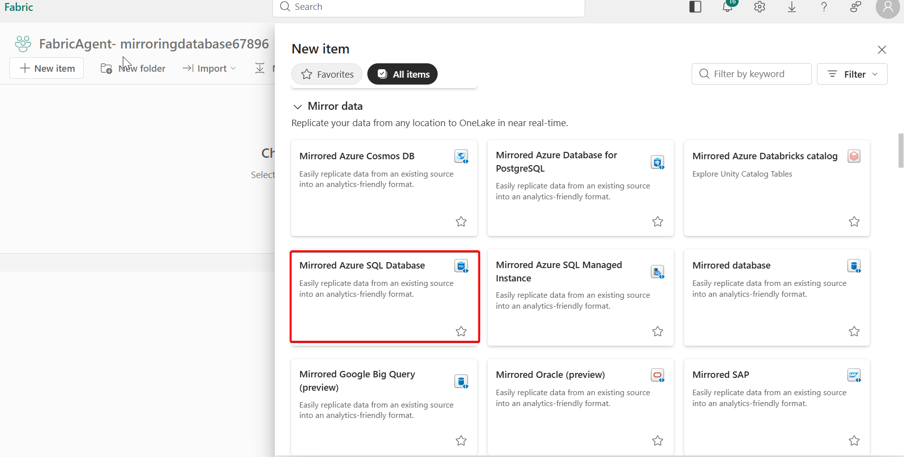

2.  **「Choose a database connection to get started」**ウィンドウで、
    **Azure SQL Database**を選択します。

3.  接続設定タブで以下の詳細を入力し、「Connect」ボタンをクリックします。

    | Field | Value |
    |------|-------|
    | Server | SQL server URL saved in **Task 2 → Step 15** |
    | Database | +++sqldatabase@lab.LabInstance.Id+++ |
    | Username | +++sqladmin+++ |
    | Password | +++password321!+++ |

7.  **「Choose data」ウィンドウ**で**「Select all」**を選択し、
    **「Connect」**ボタンをクリックします。

> 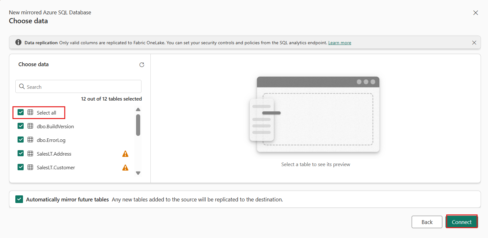

8.  「Destination」タブで、 **「Create mirrored
    database」**をクリックします。

> 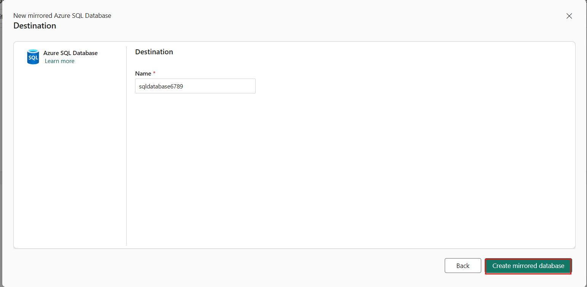

9.  **「Refresh」**をクリックして、最新の変更内容を確認します。

> 
>
> 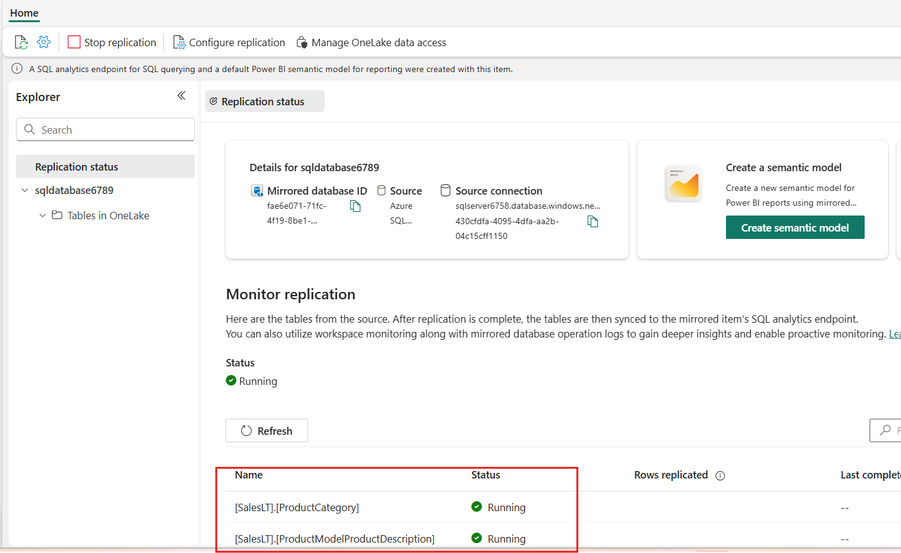

1.  左側のナビゲーションメニューで、下の画像に示すように、
    ***「FabricAgent- mirroringdatabaseXXXX 」*に移動します。**

> 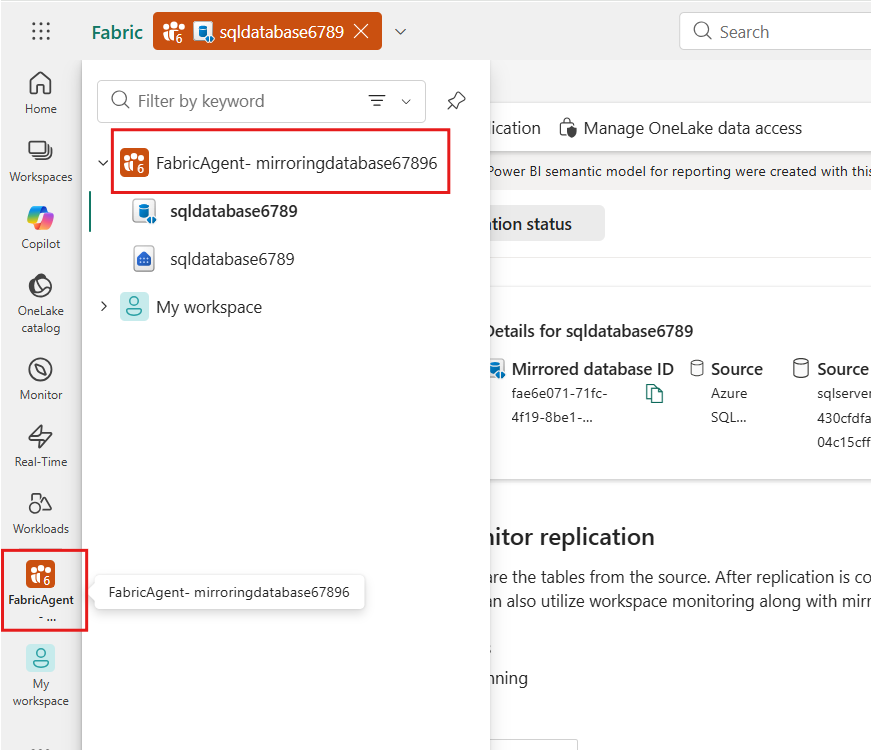

## タスク4： Data agent を作成し、ミラーリングされたデータベースに接続

ここでは、新しいFabric Data Agentを作成し、ミラーリングされたAzure SQL
Databaseをデータソースとして使用するように構成します。このエージェントは、ミラーリングされたデータを使用して自然言語によるプロンプトに応答します。

1.  **Fabric**のホームページで、 **「+** **New
    item」**を選択します**。**

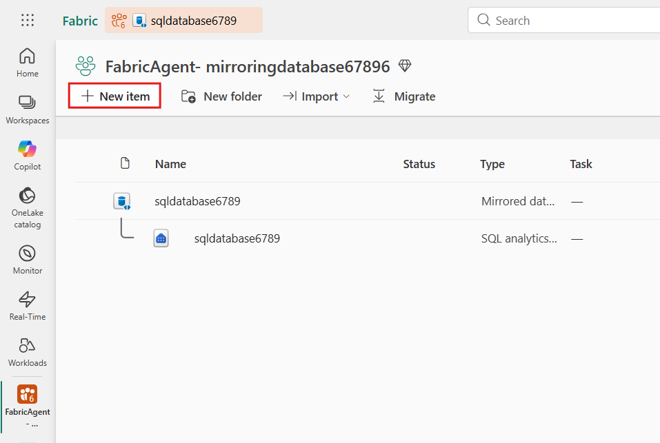

3.  **「Filter by item type」検索ボックス**に**「+++data
    agent+++」**と入力し、「**Data agent」を選択します。**

> 

4.  Data agent名として**+++FabricDataAgent
    @lab.LabInstance.Id+++を**入力し、 **\[Create\]**を選択します。

> 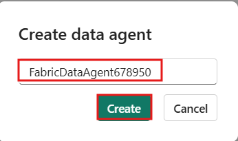

5.  **「Add data source」**を選択して、新しいデータソースを設定します。

> 

6.  このワークショップで使用するミラーリングされたデータベースリソースを選択します。

> 
>
> 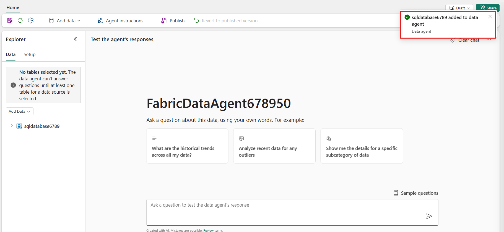

## タスク5：エージェントのテスト

Data Agent をテストするには、次のような分析的な質問をします。

- *どの製品カテゴリーが最も高い売上を生み出していますか。*

- *定価は高いが販売量が少ない商品の詳細を提供します。*

- *顧客数が最も多い都市はどこですか。*

これにより、エージェントがビジネス上の問い合わせを理解し、対応する能力を  
証明します。

1.  すべてのテーブルに対して**SalesLT**スキーマを選択します。

2.  「+++**Which product categories generate the highest sales?**+++」という質問を入力し、Sendアイコンをクリックしてエージェントの応答を表示します。

3.  エージェントをテストするには、アプリケーションを実行し、サンプル質問を入力して応答を確認します。

++++List products with high list price but low sales volume.+++

+++**List the cities with the highest number of customers**+++

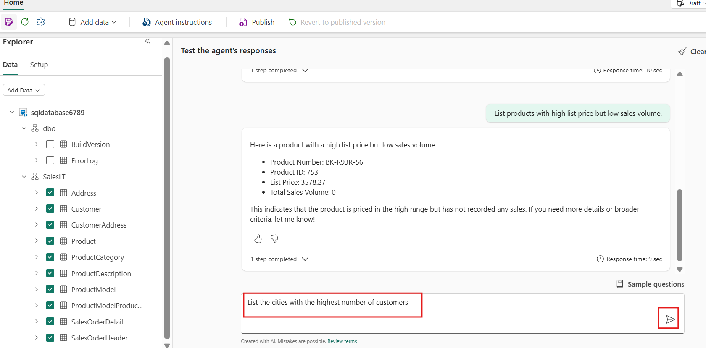

> 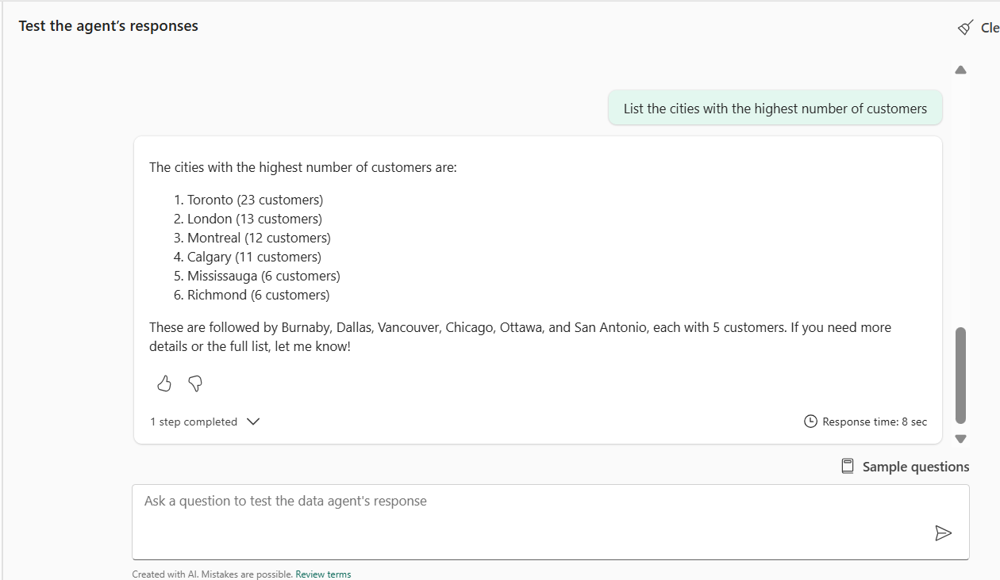

4.  上部メニューから**「Agent instructions」**をクリックします。

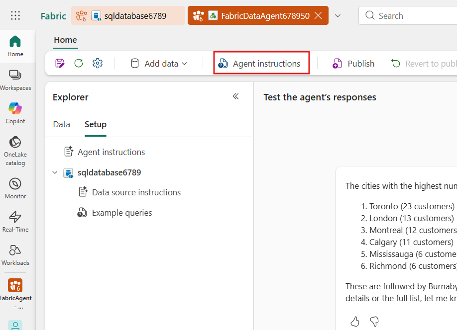

5.  上部メニューから「**Publish**」をクリックし、
    **「Publish」**を選択します。

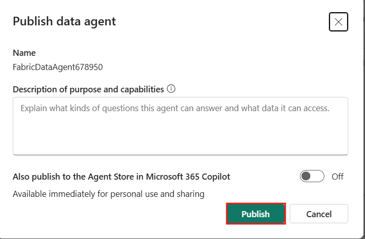

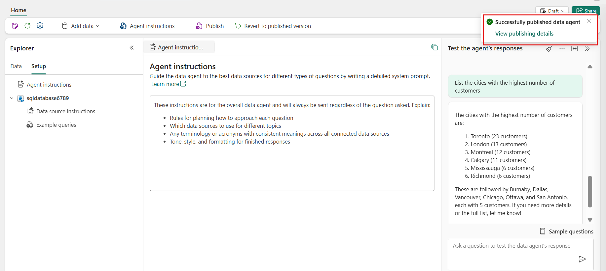

6.  次に、左側のナビゲーションペインにある**「FabricAgent -
    mirroringdatabaseXXXXXX 」**をクリックします。

## タスク6：リソースを削除

1.  ワークスペース名の下にある「 **...」**オプションを選択し、
    **「Workspace settings」**を選択します。

> 

2.  **「General」**を選択し、 **「Remove this
    workspace」**を選択します。

> 

3.  表示された警告メッセージで**「Delete」**をクリックします。

> 

4.  次のラボに進む前に、ワークスペースが削除されたという通知が表示されるまでお待ちください。

> 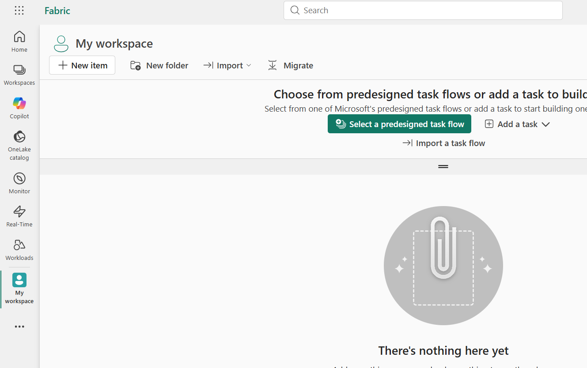

7.  ブラウザを開き、+++https://portal.azure.com+++
    にアクセスして、以下のクラウドスライスアカウントでサインインします。

8.  リソースを削除するには、 Azure ポータル検索バーに**「Resource
    groups」**と入力し、**「Services」**の下にある**「Resource
    groups」**をクリックします。

9.  Resource groupsページで、リソースグループを選択します。

10. **Resource Group**のホームページで、**Fabric
    Capacity**以外のすべてのリソースを選択し、
    **\[Delete\]**をクリックします。

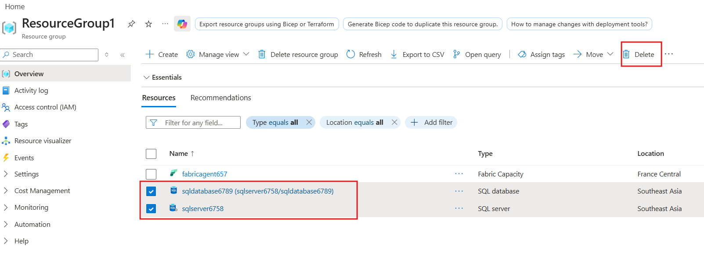

11. 右側に表示される**「Delete Resources」**ペインで、 **「Enter
    “delete” to confirm
    deletion」**フィールドに移動し、「**Delete」**ボタンをクリックします。

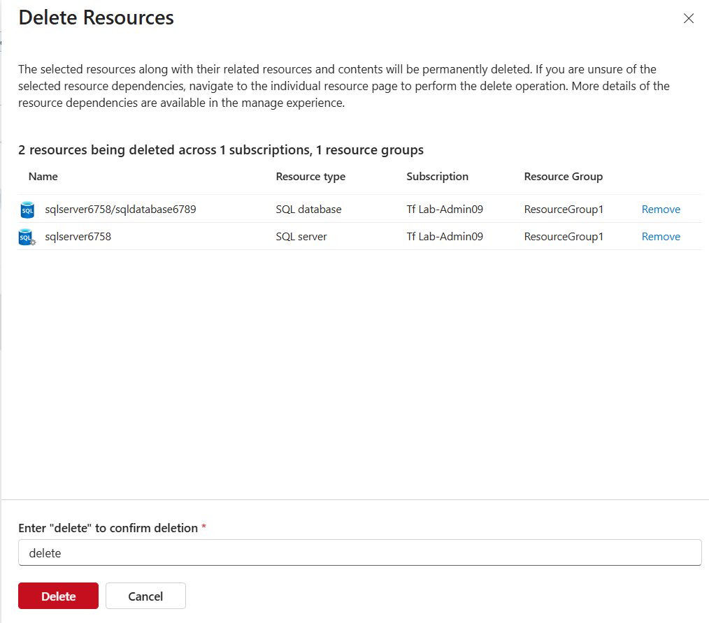

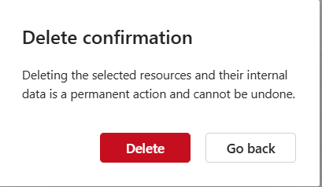

**まとめ**

このラボでは、 Azure SQL Databaseを正常に作成し、Azure SQL
Mirroringを使用してそのデータを Microsoft Fabric
にミラーリングしました。次に、Fabric Data Agent
を構成してミラーリングされたデータベースに接続し、自然言語クエリを使用してデータを分析しました。

このエージェントは、売れ行きの良い製品カテゴリ、高価格ながら販売数が少ない製品、顧客数が最も多い都市の特定といった、分析的な質問に回答することができました。これは、Microsoft
Fabricがいかにしてオペレーショナルデータソースとインテリジェントエージェントを統合し、データ探索を簡素化して、より迅速なビジネスインサイトの獲得を可能にするかを示しています。

このユースケースは、Microsoft
Fabricエコシステム内で、**データミラーリングとAI搭載 Data
Agent**を組み合わせることで、対話型かつインテリジェントデータ体験を実現する力を示しています**。**
